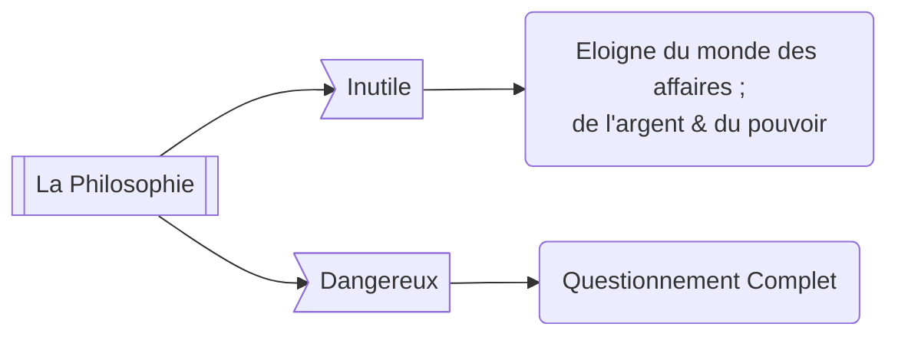

#### Fiche écrite par Guilhem :D[^1]

# 📖 Texte
- 📜 La République V
- 👤 Auteur: **Platon** (celons **Socrate**)
- 📆 Publié ~400 av. JC

# ☃️ Introduction
L'ouvrage de **La République** a pour but de mener une réflexion sur ce qu'est la justice et cherche à définir une cité idéale.

# 1️⃣ Philosophie et Philodoxie

## 🌺 Le désir de la sagesse
> *Le désir est l'experience d'un manque, de la conscience de ce manque et de l’impulsion qui est sensé résoudre ce manque.*

La première partie du texte interroge l'aspect étymologique du mot **philosophie**. Dans l'idée, $$philo$$ signifie **désir** ou **amour** et $$sophia$$ serait **sagesse**. Ce passage ne définit pas la sagesse, mais en revanche utilise la notion de désir.

En effet, il utilise des exemples tel qu el'amateur de vin pour justifier son hypothèse que le philosophe n'est pas quelqu'un avec l'amour d'un savoir en particulier mais de toute la sagesse, dans son ensemble, *tel qu'un amateur de vin apprécie tout bon vin*.

Mais comparé à la définition juste au dessus, cela signifierais que le philosophe n'est en réalité pas sage car il désir ce qu'il n'a pas ? La suite du texte va essayer de distinguer le philosophe d'une autre manière, en utilisant quelque chose qui lui ressemble et quelque chose de complètement opposé.

## 🌫️ Misologie et indifférence au savoir

Le soucis est de définir ce qu'il y a de plus dans la philosophie qui n'est pas présent dans le savoir. Par exemple, un philosophe ne peut pas être un criminel, un savant oui.

Le texte utilise d'abord l'idée du **réfractaire à la connaissance**, complètement opposé au philosophe.
Celui si désir en outre quelque chose d'autre ; l'argent, le bonheur, la reconnaissance ; et considère le savoir comme une perte de temps, la philosophie comme un bavardage vain.

Pour appuier cette position, nous nous basons sur une citation du Georgias, 3em, entre Socrate et Calliclès. Ils développent l'idée suivante : 
>  ## "*La philosophie est un bavardage inutile et dangereux.*"
### Un bavardage inutile...
La philosophie n'est pas lucrative ; elle n'apporte que la vérité, mais qui elle même n'apporte aucun pouvoir. Elle éloigne du monde des affaires, des intérêts économiques, ce qui compte vraiment et forme une vie heureuse.

> [!NOTE]
> 
> L'argent est une forme de pouvoir.

Il considère cependant que la philosophie a une importance temporaire : elle permet pendant la jeunesse d'apprendre comment contrôler la parole et exploiter son pouvoir.

Sa réflexion est cependant jonché de contres sens : il confond ici la rhétorique et la philosophie, puis considère se considère libre alors que c'est bien la philosophie qui libère les âmes 

### .. et dangereux

La philosophie est un usage du dialogue qui déstabilise, qui met en crise. Socrate a été condamné à mort, suspecté de corrompre la pensé des jeunes.

> "*La science rassure, l'art inquiète.*"

Ce qui inquiète, on veux s'en débarrasser. 

Cependant, avec cette définition, on risque de confondre l'intellectuel et le philosophe... D'où

## 🎭 L’amateur de spectacles : le philodoxe

La pensé est définit fondamentalement comme un bien véritable. Hors la plupart des hommes ne prennent pas soin de leurs pensées.

Le philodoxe est celui qui aime l’opinion, l'apparence. 

[^1]: Note: je fait du mieux que je peux pour rendre la fiche lisible et cohérente, mais plus on avance dans le cours et plus les exemples se mélangent et sont de plus en plus confus.