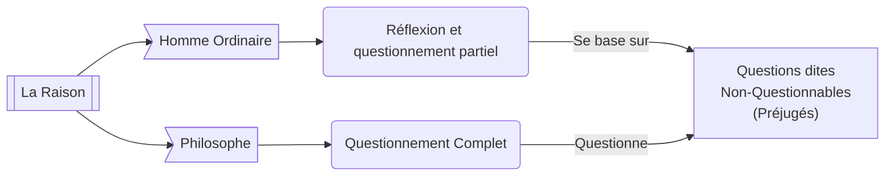
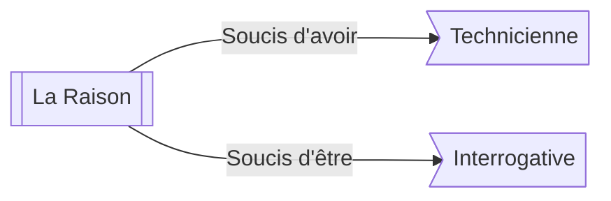

# 📖 Texte
- 👤 Auteur: **Ian Patocka**
- 📆 Publié en 1934

# ☃️ Introduction
*Es ce que l'homme ordinaire ne réfléchit pas du tout ?*

Le texte parle des distinctions entre les différents "modes" de raison. Il met en valeur la perte du raisonnement philosophique chez les êtres humains, du aux impératifs de la vie et le conditionnement de la société.

Il y a bien deux manières de vivre **mais pas deux types d'hommes**.

Il arrive cependant que certaines questions (tel que le *Il faut s'adapter*) entraîne **un éveil à la liberté**.
# 1️⃣ La vie ordinaire - le send de la vie accepté
Le premier paragraphe du texte incite sur la singularité du mode de pensé philosophique.

## 🌿 Croyance Naturelle
> Synonymes : Opinion Originaire, Attitude Naturelle, Foix Perceptive

La **Croyance Naturelle** est une base que tout humain possède et acquis à la naissance. Elle inclut :
- L'existence de soi et du monde
- *Toute autre question (in)fondé ?*

La philosophie née de **l'étonnement face à l'existence de ces croyances**.

## 🧩 Conditionnement Culturel
> Synonymes : Aucuns

Contrairement au croyances naturelles, le conditionnement culturel est acquis durant l'existence d'un individu. Cela inclut :

### 📜 Les traditions
- L'opinion politique
- La religion, même até
- L'évolution technologie et temporelle

> L'époque et les créations techniques nous influence dans le sens où la communication (avec les resaux sociaux & internet) qui ont drastiquement modifiés nos relations sociales.

### 🪗 La Langue
La langue est un paradoxe : la ou elle paraît être un outil qui libéré la pensé, son existence permet aussi de la limiter. La langue est composé de trois objets :
- **La Langue** : Un ensemble de règles communes (la grammaire et le lexique)
   - Le lexique (les mots) possèdent une histoire chargé d'un sens qui nous ont été légués.
   - La grammaire, qui considère que le sujet est maître de son action alors que nous avons déjà vu precedement que ce n'est pas le cas.
- **La Parole** : L'acte singulier d'expression d'un individu et une Langue
- **Le Language** : La faculté de parler (utiliser la parole) en utilisant une langue.

### ⛅ Le Kosmotheoros
Le Kosmotheoros est une entité imaginaire qui serait sans appartenances. Un être immortel, de surplomb, de survol.

### ❄️ La Finitude
La finitude est l'inverse du [[#🌥 Le Kosmotheoros|Kosmotheoros]], c'est justement la fin de la vie qui stimule l'humain à créer, agir.

# 2️⃣ Ébranlement et étonnement : la vie interrogé

Après avoir montré la finitude humaine et le conditionnement que tout les Hommes subissent, il s'agit de savoir ce qui va donner impulsion à la reflexion
## ☄️ Les experiences négatives et l'éveil de la raison

Ce deuxième paragraphe explicite les différentes expériences négatives existantes :
- Déception
- Trahison
- Mort Subite
- Crise
- Catastrophe 
- Deuil

Elle sont décrites comme un bouleversement, un Émébranlement, une "*supension dans le vide*". 

Mais on peut se demander pourquoi les expériences négatives amènerais à la réflexion, alors qu'elle nous font plus penser au désarrois, à la tristesse...
Pour comprendre le concept d'experiences négatives, nous devons d'abord mettre en lumière celle des expériences d'évenements :

|                FAIT                |                                           ÉVÉNEMENT                                            |
| :--------------------------------: | :--------------------------------------------------------------------------------------------: |
|          Cause déterminé           |                          Pas de cause précise ou de raison suffisante                          |
|  Continuité avec le monde commun   | Crise, ébranlement. Déstabilisation, transformation, ouverture ou naissance d'un nouveau monde |
| Le fait en question est explicable |                                          Inexplicable                                          |

# 3️⃣ L’événement de la parole philosophique

# 4️⃣ L'étonnement philosophique

Patocka aborde un autre type d'experience à la racine de la philosophie : **l’événement**. Il est beaucoup plus profond que les experiences négatives.

Curiosité (Ontique) ≠ Étonnement (Ontologique)

# *️⃣ Conclusion

A l'aube de ce texte, on progresse dans la réflexion sur ce que signifie que penser par soi-même, une croyance naive de l'être humain qui oublie la réalité du conditionnement et de la finitude.

**Pour amener la réflexion, il faut une impulsion, une experience négative, un événement :**

-> Penser contre la société, contre autrui, contre la langue

-> Penser contre soit même, contre nos croyances introverties

-> Penser avec autrui, hériter par et avec les Oeuvres de Culture
> *Les oeuvres de cultures sont  des oeuvres philosophiques, mais aussi des textes littératies ou des oeuvres d'arts. Toutes ces créations ont une d'ébranlement, contre le réflexe de la pensée automatique.* 

##### On a donc jamais finit de chercher la vérité et la liberté