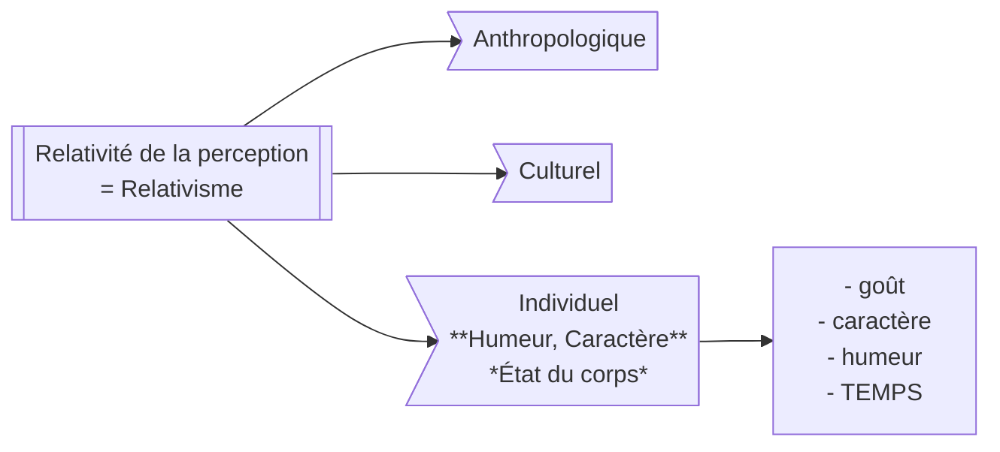

# L'impression de la Raison et de la Relativité
## Réflexion Épistémologique
### Relativité de la perception
Montaigne considère la perceptions - les données reçu par notre cerveau - comme relative et interdisant toute connaissance subjective. Il va d'abord prendre l'exemple de la maladie, du sommeil et de la folie pour démontrer que certains états humains manipule notre perception, généraliser sa conclusion à tout les états de l'être humain.

***Comment justifier cette généralisation ?***

*Le caractère est plus stable comparé à l'humeur, mais ni l'un, ni l'autre ne sont invariables.*

Nous ne **percevons** que des **apparences**. La perception est donc objective - et aucun vrais savoir ne peut donc en être tiré.
C'est l'image des instruments de mesure faussés. Le résultat est de travers.

### Relativité du jugement
#### L'exercice de la raison & du jugement ne permet pas plus que l'essence de fonder un jugement subjectif
On ne peut pas juger quoi que ce soit, car on est forcément d'une part ou d'une autre. Deux exemples:
- **La religion** : On ne peut pas être ni até, ni religieux
- **L'Âge** : On ne peut pas avoir aucun âge
*Une exception : le [Kosmothéoros](/philo/def#-le-kosmotheoros)*

#### Impossibilité de la demonstration et illusion de la raison
Un raisonnement nécessite une justification. Mais cette justification doit être justifié par un autre raisonnement, qui doit être lui aussi prouvé, et on n'en finit plus.

---

L'addition de ces deux points forment le [Scepticisme](/philo/def#scepticisme). Montaigne critique donc la Philosophie Rationaliste.

| Pyrrhon & Sextus Empiris                            | Montaigne                 |     |
| --------------------------------------------------- | ------------------------- | --- |
| ISOTHÉNIE -> l'équilibre des arguments vrais & faux | [[#ISOTHÉNIE impossible]] |     |
| ÉPOCHÉ -> Suspension du jugement                    | [[#ÉPOCHÉ impossible]]                     |     |
| ATARAXIE -> Paix de l'âme                           |                           |     |

<h4>💖 Idée de bonheur</h4>

#### L'avis de Montaigne
##### ISOTHÉNIE impossible
Les idées sont chargés d'[[/philo/def#Affects]], on a toujours en nous une idée plus forte qu'une autre. Exemple avec le Cannibalisme : une idée, deux affects fondamentale différents (j'aime/t'es fou)

**Que devient la liberté de la pensée ?**
##### ÉPOCHÉ impossible
##### ATARAXIE impossible

## Réflexion Ontologique
L'eau dans la rivière est une partie du monde, mais elle est mobile, jamais la même - Nul homme ne s'est baigné dans la meme rivière. Toute chose est en perpétuel mouvement. L'Ontologie devient paradoxale car il n'y a plus d'être, et comme aucune chose ne peut grader une propriété immuable.

**L'Ontlogie met donc en crise les deux principes essentiels suivant :**
- Le principe d'identité: A = A
- Le principe de non contradiction

Le concept de mouvement/temporalité est donc pensée de deux manières :

1. **Classique:** Aquiert des propriétés mais fondamentalement reste la même.
2. **Radical:** Rien ne demeure en nous, tout change.