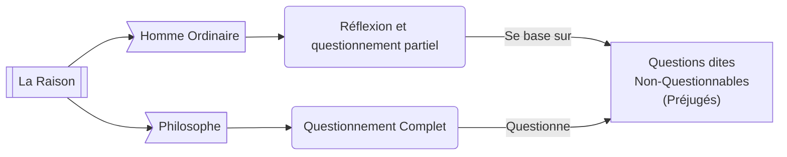
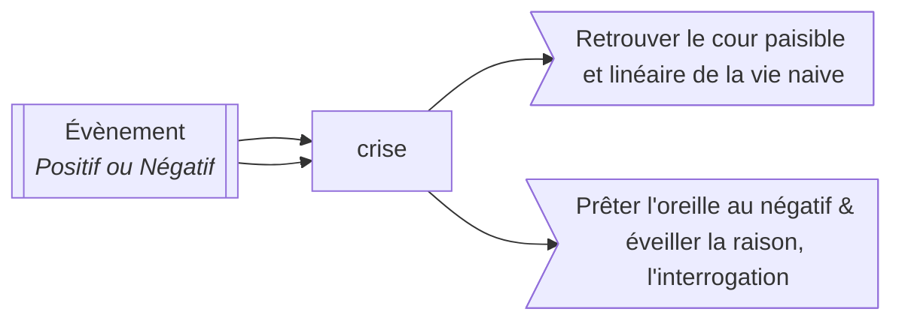
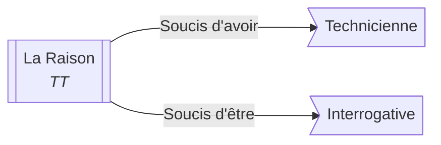

> [!Todo] Fiche écrite par Guilhem :D

# 📖 Texte
- 👤 Auteur: **Jan Patočka**
- 📆 Publié en 1934

# ☃️ Introduction
*Est-ce que l'homme ordinaire ne réfléchit pas du tout ?*

Le texte parle des distinctions entre les différents "modes" de raison. Il met en valeur la perte du raisonnement philosophique chez les êtres humains, du aux impératifs de la vie et le conditionnement de la société.

Il y a bien deux manières de vivre **mais pas deux types d'hommes**.

Il arrive cependant que certaines questions (tel que le *Il faut s'adapter*) entraîne **un éveil à la liberté**.

Il n'y a interrogation philosophique que sur ce qui paraît évident à tout le monde.

# 1️⃣ La vie ordinaire - le sens de la vie accepté
Le premier paragraphe du texte incite sur la singularité du mode de pensé philosophique.

## 🌿 Croyance Naturelle
> Synonymes : Opinion Originaire, Attitude Naturelle, Foi Perceptive

La **Croyance Naturelle** est une base que tout humain possède et acquis à la naissance. Elle inclut :
- L'existence de soi et du monde
- *Toute autre question (in)fondé ?*

Tout type d'activité et de réflexion suppose cette croyance. Par exemple, le scientifique met de côté sa religion lors d'une expérience, mais il ne se demande pas si les objets qu'il étudie, si lui, si le monde existe.

> Note additionnelle : la Croyance est subjective quand le savoir est justifié.

La philosophie née de **l'étonnement face à l'existence de ces croyances**.

## 🧩 Conditionnement Culturel
> Synonymes : Aucuns

Contrairement au croyances naturelles, le conditionnement culturel est acquis durant l'existence d'un individu. Cela inclut :

### 📜 Les traditions
- L'opinion politique
- La religion, même até
- L'évolution technologie et temporelle

> L'époque et les créations techniques nous influence dans le sens où la communication (avec les réseaux sociaux & internet) qui ont drastiquement modifiés nos relations sociales.

### 🪗 La Langue
La langue est un paradoxe : là où elle paraît être un outil qui libère la pensée, son existence permet aussi de la limiter. La langue est composé de trois objets :
- **La Langue** : Un ensemble de règles communes (la grammaire et le lexique)
  - Le lexique (les mots) possèdent une histoire chargé d'un sens qui nous ont été légués.
  - La grammaire, qui considère que le sujet est maître de son action alors que nous avons déjà vu précédemment que ce n'est pas le cas.
- **La Parole** : L'acte singulier d'expression d'un individu et une Langue
- **Le Language** : La faculté de parler (utiliser la parole) en utilisant une langue.

### 🏫 L'École
L'école est tout d'abord le fruit d'un conditionnement : le contexte socio-historique et l'émancipation des conscience l'a fait évolué.

Mais l'école a aussi pour rôle de nous faire apprendre, intérioriser, des concept et notions définit que nous ne questionnons pas et dont nous ne pouvons nous émanciper - nous avons donc la aussi une forme de conditionnement.

### ⛅ Le Kosmotheoros
Le Kosmotheoros est une entité imaginaire qui serait sans appartenances. Un être immortel, de surplomb, de survol. Pour lui, il n'y a pas d'après. Il est difficile pour nous de le limiter car il est par définition infinite, sans limites.

### ❄️ La Finitude
La finitude est l'inverse du [[#🌥 Le Kosmotheoros|Kosmotheoros]], c'est la notion de temps, de fin, d'après. C'est justement la fin de la vie qui stimule l'humain à créer, agir.

**Le Conditionnement est tellement enraciné en nous qu'on pourrait se demander comment peut on en sortir**

# 2️⃣ Ébranlement et étonnement : la vie interrogé

Après avoir montré la finitude humaine et le conditionnement que tout les Hommes subissent, il s'agit de savoir ce qui va donner impulsion à la réflexion
## ☄️ Les experiences négatives et l'éveil de la raison

Ce deuxième paragraphe explicite les différentes expériences négatives existantes :
- Déception
- Trahison
- Mort Subite
- Crise
- Catastrophe 
- Deuil

Elle sont décrites comme un bouleversement, un Émébranlement, une "*suspension dans le vide*".

Mais on peut se demander pourquoi les expériences négatives amènerais à la réflexion, alors qu'elle nous font plus penser au désarrois, à la tristesse...
Pour comprendre le concept d'experiences négatives, nous devons d'abord mettre en lumière celle des expériences d’événements :

|                FAIT                |                                           ÉVÉNEMENT                                            |
| :--------------------------------: | :--------------------------------------------------------------------------------------------: |
|          Cause déterminé           |                          Pas de cause précise ou de raison suffisante                          |
|  Continuité avec le monde commun   | Crise, ébranlement. Déstabilisation, transformation, ouverture ou naissance d'un nouveau monde |
| Le fait en question est explicable |                                          Inexplicable                                          |

### 🤓 La Contingence 
Les Événements et Expériences questionne la Contingence : **ce qui peut ou aurais pu ne pas être ou être autrement.**

# 3️⃣ L’événement de la parole philosophique

*Passage de Socrate et Gorgias*

Le raisonnement se déploie toujours sur un fond de préjudices inaperçus considéré par tout le monde comme fondés.
Le savoir n'est pas une opinion, mais n'est pas non plus une opinion accompagné d'une justification. Pb de cette partie : le prof nous a dit le contraire

# 4️⃣ L'étonnement philosophique

Patočka aborde un autre type d'experience à la racine de la philosophie : **l’événement**. Il est beaucoup plus profond que les experiences négatives.

Mais avant d'étudier l'étonnement, nous devons bien le différencier de **la curiosité**

## 🧐 La Curiosité (Ontique)

La curiosité est dite Ontique, c'est à dire qu'elle est relative à un l'état, à quelque chose de déterminé. 

Exemples:
- Un animal dans une classe: *Que fait-il là ?*
- Domaine politique/people : *Enquête sur une personne donné*

## 🤯 L'Étonnement (Ontologique)
l’étonnement est global sur tout l'état, devant l'étrangeté de qui nous somme et de l'existence du monde.
**Il y a un affect**. La conscience philosophique s'éveil sous l'effet de l'étonnement et est animé par un désir de vérité.

Exemples:
- La crise de 29: *Questionnement*
- Le Deuil: *déterminé ***MAIS*** nous confronte à la question de notre existence. A cheval sur experience négative et étonnement.*

## 😵‍💫 Paradoxe

Le philosophe veux lutter contre les affects (les émotions), mais la source de la philosophie provient des affects.

# *️⃣ Conclusion

A l'aube de ce texte, on progresse dans la réflexion sur ce que signifie que penser par soi-même, une croyance naive de l'être humain qui oublie la réalité du conditionnement et de la finitude.

**Pour amener la réflexion, il faut une impulsion, une experience négative, un événement :**

-> Penser contre la société, contre autrui, contre la langue

-> Penser contre soit même, contre nos croyances introverties

-> Penser avec autrui, hériter par et avec les Oeuvres de Culture
> *Les oeuvres de cultures sont  des oeuvres philosophiques, mais aussi des textes littératies ou des oeuvres d'arts. Toutes ces créations ont une d'ébranlement, contre le réflexe de la pensée automatique.* 

##### On a donc jamais finit de chercher la vérité et la liberté