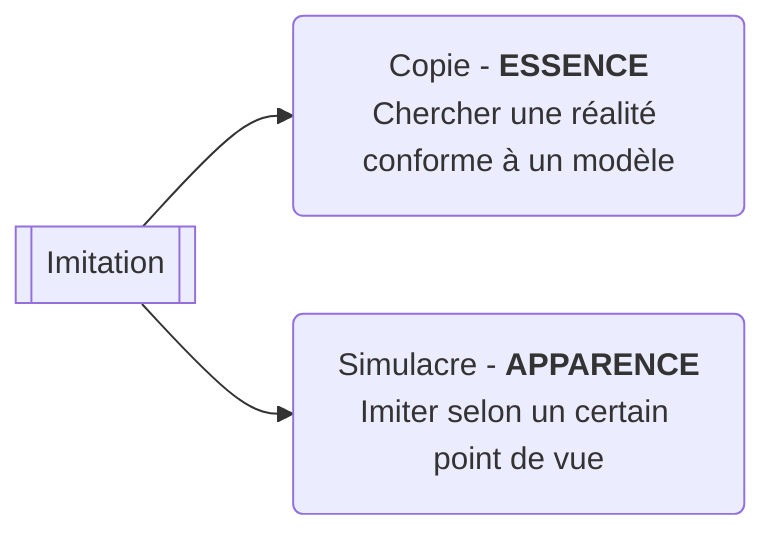

# Imitation : le danger du simulacre

Socrate pense l'art par l'imitation

...

L'Art pose alors problème : elle apporte une corruption des meurs. Pour les grecs, la vérité est associé au bon et au beau.